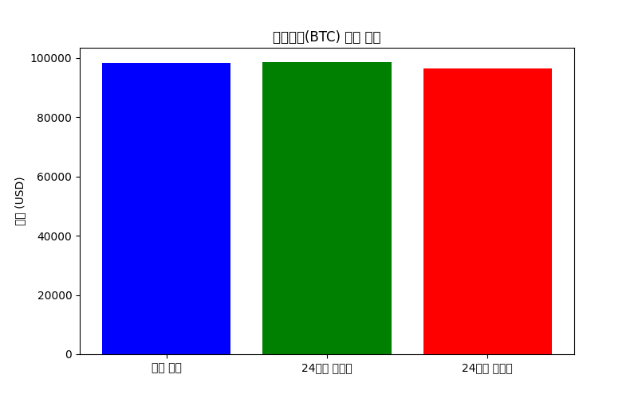

# Crypto Price Status

이 리포지토리는 ccdata.io API를 사용하여 비트코인(BTC)의 가격 정보를 자동으로 업데이트합니다.

## 현재 비트코인 가격
> BTC/USD 현재 가격: $98174.5273311245
- 시가: $96633.7078182933
- 24시간 최고가: $98464.0873256023
- 24시간 최저가: $96459.7447282456
- 24시간 변화량: $1540.8195128312 (1.59%)
- 24시간 거래량: 7334.32239356 BTC

⏳ 업데이트 시간: 2025-02-06 16:17:52 (UTC)

---
자동 업데이트 봇에 의해 관리됩니다.
